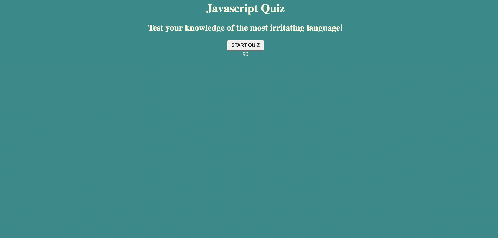

# DCC Javacript Quiz

## Table of Contents: 
[Description](#description)

[Installation](#installation)

[Usage](#usage)

[Contributions](#contributions)

[License](#license)

[Questions](#questions)

## Description: 
A simple quiz made up of four questions to test beginning developers on their knowledge of Javascript basics.

## Installation: 
N/A

## Usage: 
This application will test your knowledge of basic Javascript principles. After completing the time restricted quiz, your name and score will be saved in local storage on your browser. They will also be displayed on the screen.

## Contributions: 
Luis Pineda, Nic Catania, Julio Valdez

## License: 
N/A

## Questions: 
Github Username: https://github.com/darthcurtiscass

Email: dylancurtiscassagnol@icloud.com
